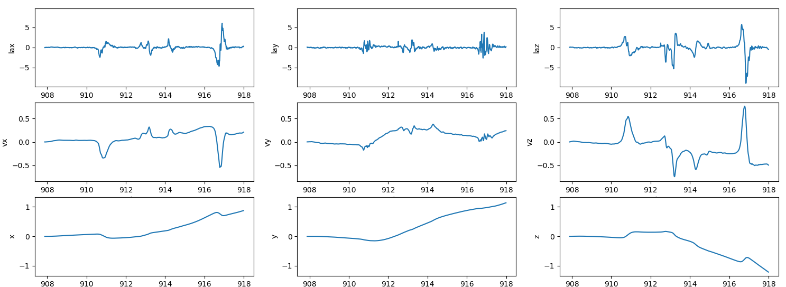
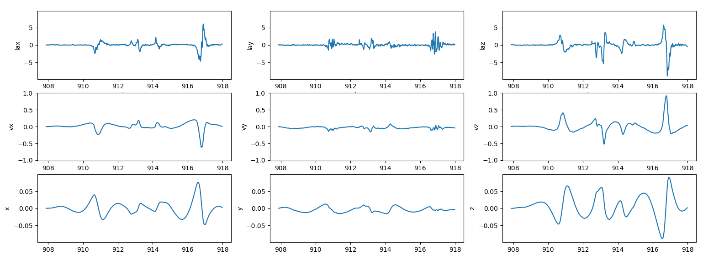
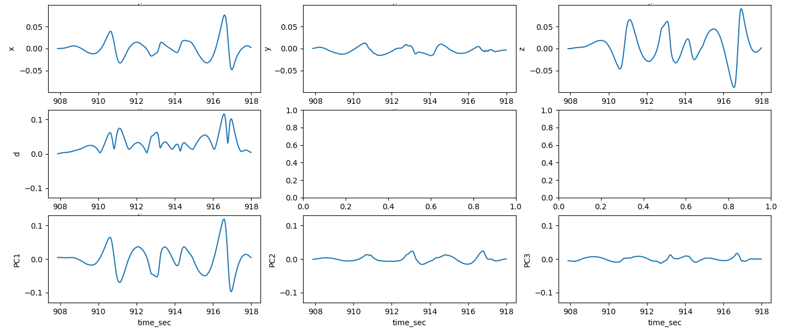
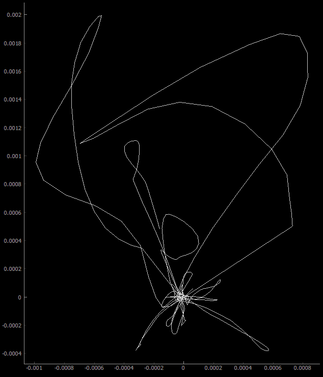
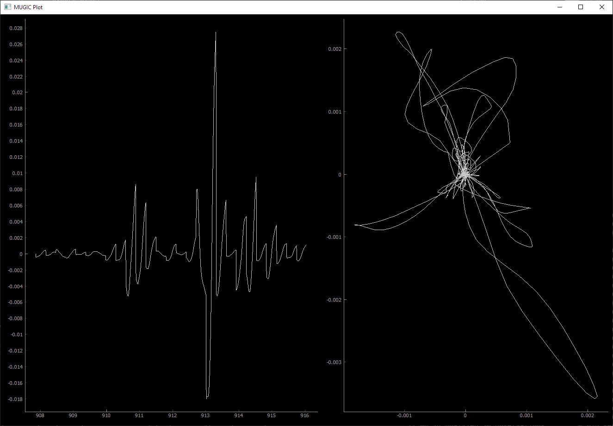

```{r, include=FALSE}
# Package svg must be able to reach inkscape to include the SVGs
options(tinytex.engine_args = '-shell-escape')
```

# Introduction

The MUGIC device bridges what is audible with what is mobile, measuring the movement of the musician who wears it and enabling new methods of performance driven by data. Many various applications of this device have been developed, ranging from the alteration of instrumental sounds to the real-time synthesis of a musical track.

In this project, we leverage the device's capabilities as a metric of its wearer's instrumental technique, particularly in the case of a violinist. In having a violinist wear the device on the hand used for bowing, we can measure the motion of their bowing and assess the stability in which they play their instrument.

\begin{figure}
  \centering
  \includesvg[width = 0.8\linewidth]{img/schema}
  \caption{An illustration of the two-dimensional plane of possible unstable motion, compared to the axis of stable bowing motion.}
\end{figure}

# Project Pipeline

## Retrieving Data from the Device

The MUGIC device supports the transmission of data over both serial and wireless connections. In order to facilitate analysis independent of the method of transmission, I first developed an interface on top of the differing Python APIs for UDP and serial connections, allowing external code to read device measurements irrespective of the connection used.

```python
class DataStream:
    def readline(self) -> bytes:
        pass

    def readlines(self, n) -> [bytes]:
        return [self.readline() for _ in range(n)]

    def read_for_time(self, seconds) -> bytes:
        output = []
        start_time = time.time()

        while time.time() - start_time < seconds:
            output.append(self.readline())

        return output
        
    def close(self):
        pass
```
I then created `SerialStream` and `UDPStream` classes that implemented the constructors and `readline` and `close` methods needed. I also developed a `SimulatedStream` class, allowing code to read lines from a saved chunk of device output, which allows for data analysis without having the physical device present.

## Data Pre-Processing

At the time of writing, the MUGIC device is capable of outputting the following measurements:

```
| Accelerometer      | Gyroscope     | Magnetometer    |
| Euler angles       | Quaternions   | Timestamp       |
| Accel. status      | Gyro. status  | Mag. status     |
| Battery percentage | System status | Sequence number |
```

For the purposes of deriving device position, we interest ourselves in the accelerometer measurements, the quaternions, and the timestamps.

#### Quaternion Rotation

In order to obtain linear acceleration from the accelerometer output, we needed to fix the reference frame using the quaternion data. To do so, I created a three-dimensional array `R` such that each `R[:, :, i]` is the quaternion rotation matrix of the `i`th sample of data.

```python
q_norm = np.sqrt(qw ** 2 + qx ** 2 + qy ** 2 + qz ** 2)
qw /= q_norm
qx /= q_norm
qy /= q_norm
qz /= q_norm

R = np.zeros((3, 3, qw.shape[0]))
R[0, 0, :] = 1 - 2*(qy**2 + qz**2)
R[1, 0, :] = 2*(qx*qy + qz*qw)
R[2, 0, :] = 2*(qx*qz - qy*qw)
R[0, 1, :] = 2*(qx*qy - qz*qw)
R[1, 1, :] = 1 - 2*(qx**2 + qz**2)
R[2, 1, :] = 2*(qy*qz + qx*qw)
R[0, 2, :] = 2*(qx*qz + qy*qw)
R[1, 2, :] = 2*(qy*qz - qx*qw)
R[2, 2, :] = 1 - 2 * (qx ** 2 + qy ** 2)
```

#### Filtering out the Noise

We found that simply integrating the linear acceleration data did not produce an accurate position signal. The sensors in the device can report a constant drift in position, encoded as low-frequency noise in the signal. Because of this, we opted to run a high-pass, forward-backward Butterworth filter before integrating acceleration, and again run the same filter before integrating the velocity. 

```python
def integ(col, time):
    samp_rate = col.shape[0] / (time.max() - time.min())
    b, a = signal.butter(5, 0.36 * 2 / samp_rate, "high")
    col_filtered = signal.filtfilt(b, a, col)

    return np.cumsum(col_filtered / samp_rate)
```

\pagebreak





## Extracting Motion

In order to extract a signal of violin bowing motion, we needed to explore transformations of the x,y,z position data. 

#### Principal Component Analysis

Our first instinct was to observe the bowing motions as a Euclidean distance from the starting position, $\sqrt{x^2 + y^2 + z^2}$. However, we found that this did not represent the back-and-forth cycles of bowing very well, since it also factored in any other motions that the violinist created, such as side-by-side swaying. In order to isolate the motion in the bowing direction from other directions of motion, we transformed the x,y,z signals into their principal components. The first principal component was found to be a much clearer cyclic motion than the Euclidean distance.



#### Two-Dimensional Projection

In addition to measuring the bowing motion, we wanted to observe the violinist's bowing stability-- that is, how much of their total motion consists of motion other than bowing. To do so, we projected the x,y,z position vectors onto a two-dimensional plane perpendicular to the first eigenvector from the principlar component analysis performed above. Any points on this plane that deviate significantly from the origin represent unstable motion from the violinist.

This plot is particularly helpful when used in comparison between two violinists. The violinist whose plot sees the smaller maximum distance from the origin can be considered the more stable bower. An example of such a scenario could be a violin student and their instructor.



## Near-Realtime Measurement

In order to deliver this work as an application that anybody can use to examine their bowing stability, we needed to execute all the above analysis in near realtime. To do so, I wrote a Qt application that would run on two threads: a main thread, to analyze the current chunk of data and draw the necessary plots; and a data fetching thread, which would constantly retrieve new chunks of samples from the device and send them to the main thread via a queue. Since we run a filter over the sensor data before integrating, we needed our chunks to be large enough to successfully remove the low-frequency noise. The setting we decided upon was 30 samples per chunk.

The application UI displays two plots in total. On the left, the first principal component of the x,y,z positiond ata is plotted over time, to give an overarching shape to the bowing motion. On the right, the two-dimensional projection is plotted, to display the violinist's bowing stability.



This application was packaged into a Python executable package, allowing the end-user to run it via the command-line and specify which type of connection they would like to use (serial or UDP).

# Discussion

There are unimplemented ideas that may improve the performance of the near-realtime position measurement. Most notably, the sample chunk size/rate tradeoff is rather arbitrarily set at 30, meaning we plot the position information every 30 samples. Due to the filter, it is difficult to bring this too low, although there are techniques that may be useful for maintaining accuracy with smaller sets of samples. For instance, we could retrieve and prepend the previous set of samples each time we calculate the position from the current samples of acceleration. This way, we effectively have twice as many samples to run the filter on, which could allow us to reduce the sample chunk rate enough to create a system closer to real time. 

# Conclusion and Future Work

We have seen how the acceleration data from the MUGIC device can be filtered and analyzed to produce a graphical representation of its wearer's violin bowing technique. Such an application of the device, for instance, can be further developed into an educational product, allowing violin students to measure their progress in steady bowing.

There are numerous directions that this project can explore next, seeing how we have worked with the derivation of velocity and position data. One particular direction that we would like to take is gesture recognition, allowing the MUGIC device to detect specific motions from its wearer and respond in a desired manner programmed by the user. 